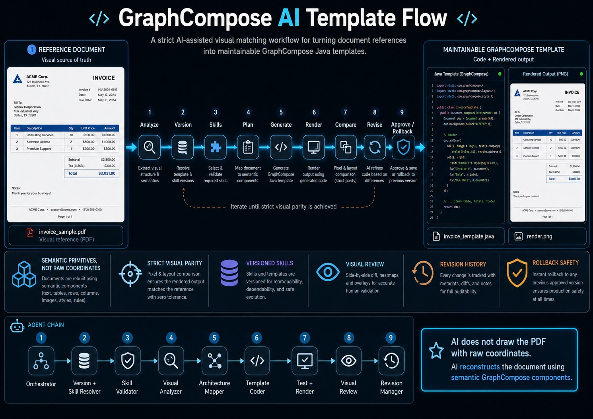

# GraphCompose AI Template Flow

[](https://github.com/DemchaAV/graphcompose-ai-flow/actions/workflows/ci.yml)



A strict AI-assisted visual matching workflow for turning document references
into maintainable GraphCompose Java templates.

AI-generated document code often becomes coordinate soup.

This project explores a stricter approach.

Instead of asking an AI agent to draw PDF elements with raw coordinates, the
agent is given a visual reference and must reconstruct it using GraphCompose
semantic primitives: sections, rows, tables, themes, layer stacks, shape
containers, layout snapshots, and visual regression checks.

The goal is strict visual parity with the reference.

Every generated output is rendered, compared, reviewed, revised, and stored as
a revision.

GraphCompose becomes the target language for the agent.

The agent does not just draw.

The agent builds a maintainable document template.

## What this is

This repository documents and demonstrates an experimental workflow where AI
agents analyze a visual reference, map it onto GraphCompose primitives,
generate Java template code, render the result, compare the output against
the reference, revise the template, and preserve revision history with
support for undo, revert-to-approved, and selective rollback.

This is a companion/lab repository for GraphCompose. It does not modify
GraphCompose core.

## Why this exists

AI-generated PDF code tends to drift toward raw coordinates and one-shot
draw calls. Those outputs are hard to read, hard to revise, and impossible to
diff in a meaningful way.

GraphCompose offers a semantic document language. By forcing the agent to
target that language under a strict visual-matching contract, the workflow
yields document templates that are reviewable, testable, and revisable like
any other Java code.

## Core idea

```text
AI не рисует PDF по координатам.
AI собирает документ из смысловых компонентов GraphCompose.
```

```text
AI does not draw the PDF with raw coordinates.
AI reconstructs the document using semantic GraphCompose components.
```

## Visual accuracy contract

The generated result must visually match the reference. Any visible mismatch
is treated as a defect unless it is explicitly classified and documented as a
known or accepted limitation. Revisions are approved only when no critical
mismatches remain and all required artifacts exist. See
[docs/visual-accuracy-contract.md](docs/visual-accuracy-contract.md).

## Workflow

The workflow runs: detect task type, resolve GraphCompose version, load and
validate the matching skill pack, analyze the reference, plan the
architecture, generate the template, compile, render, compare against the
reference, write a visual review, and then approve, reject, or roll back.
Every change creates a new revision. See [docs/workflow.md](docs/workflow.md).

## Agent architecture

Nine agents form a strict chain: Orchestrator, Version + Skill Resolver,
Skill Validator, Visual Analyzer, Architecture Mapper, Template Coder,
Test + Render, Visual Review, and Revision Manager. Each agent has a fixed
set of inputs, outputs, and forbidden behaviors. See
[docs/agents.md](docs/agents.md) and [AGENTS.md](AGENTS.md).

## Versioned skills

Skills are versioned contracts between the agent and a specific GraphCompose
API. The agent must identify the target GraphCompose version, load the
matching skill pack from `skills/versions/`, and never invent APIs. If the
library and the skill disagree, the library wins and the skill is fixed. See
[docs/versioned-skills.md](docs/versioned-skills.md).

## Revision model

Every change creates a new revision under `revisions/`. Revisions have
explicit statuses (`DRAFT`, `APPROVED`, `REJECTED`, `REVERTED`,
`SUPERSEDED`, `FAILED`), a parent pointer, and a fixed artifact layout.
Approved revisions are never overwritten directly. See
[docs/revision-model.md](docs/revision-model.md).

## Example

A documentation-grade manual revision cycle for an invoice reference
lives under [`examples/invoice-reference/`](examples/invoice-reference/).
It ships two revisions with every text artifact the workflow produces.
The binary render artifacts (`output.pdf`, `output.png`) are now
committed for both example revisions. They are produced by
[`scripts/render-invoice-reference.mjs`](scripts/render-invoice-reference.mjs),
which compiles the selected revision through
[`examples/invoice-reference/render-runner`](examples/invoice-reference/render-runner/)
and then calls [`tools/preview-renderer`](tools/preview-renderer/).

## Limitations

This project does not promise perfect screenshot-to-code conversion. Human
review remains part of the loop. Exact font matching and exact pixel parity
may be limited depending on the renderer and the available fonts. See
[docs/limitations.md](docs/limitations.md).

## Roadmap

The project ships in phases: documentation MVP, versioned skill pack, manual
example, skill validation fixtures, revision helper tool, render and preview
workflow, and visual diff experiment. See [docs/roadmap.md](docs/roadmap.md).

## Status

Phases 1 through 7 of the project plan have shipped. The
[`tools/`](tools/) folder hosts three modules: a Node revision-manager
CLI ([`revision-manager`](tools/revision-manager/)), a Java + Maven
preview-renderer ([`preview-renderer`](tools/preview-renderer/) with a
working `preview` PDF→PNG subcommand and a `render` path that executes
compiled GraphCompose templates when the runtime is on the classpath),
and a Node
visual-diff CLI ([`visual-diff`](tools/visual-diff/)). All three ship
with passing test suites and are wired to GitHub Actions CI.

GraphCompose 1.6.0 is reachable for fixture validation through
JitPack as `com.github.DemchaAV:GraphCompose:v1.6.0`. The five
fixture projects under [`examples/skill-fixtures/`](examples/skill-fixtures/)
compile and run against that artifact. The invoice reference example
also renders through the shared preview-renderer path. The remaining
gate is now visual validation orchestration: produce real layout
snapshots and run visual-diff against committed baselines. Until that
full visual pass exists, every skill in the manifest stays at
`status: needs-validation`.
See [`AUDIT.md`](AUDIT.md) for the historical audit and
[`docs/implementation-status.md`](docs/implementation-status.md) for
the current claim-vs-reality matrix.

## Positioning

```text
GraphCompose-AI-Template-Flow is an experimental companion project for GraphCompose.

It demonstrates how AI agents can turn visual document references into maintainable Java templates through a strict workflow:

Analyze -> Version -> Skills -> Plan -> Generate -> Render -> Compare -> Revise -> Approve / Rollback

The project treats GraphCompose as a semantic target language for AI-assisted document generation.

It does not promise magic screenshot-to-code conversion.

It focuses on engineering discipline:

- versioned skills
- API validation
- semantic mapping
- visual parity
- testable output
- revision history
- rollback safety
```
