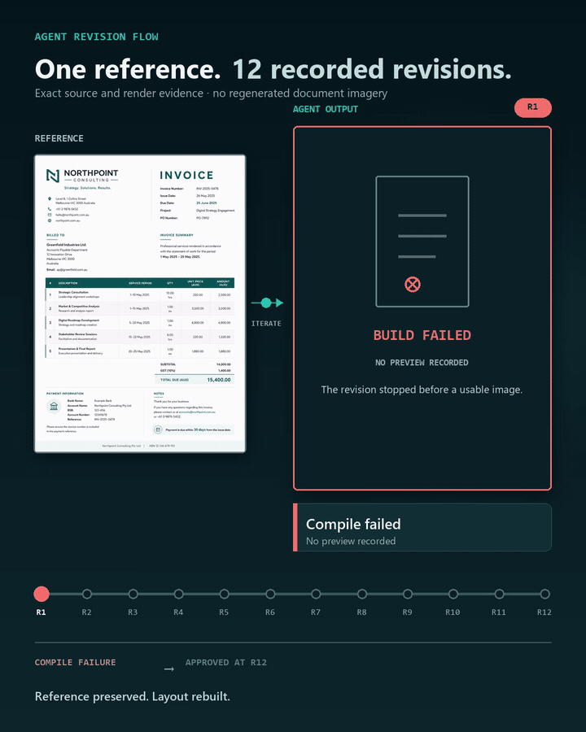
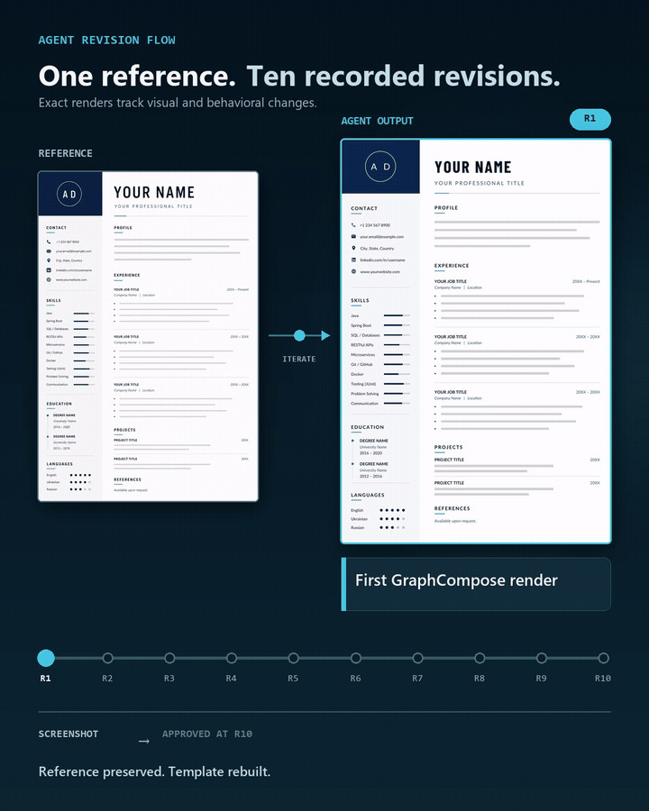
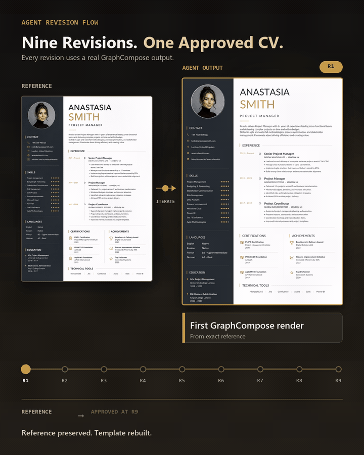
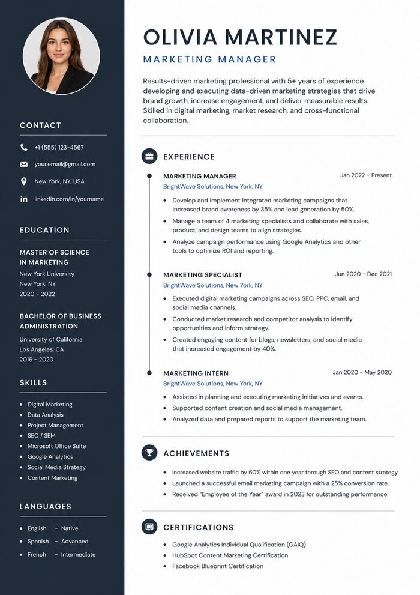
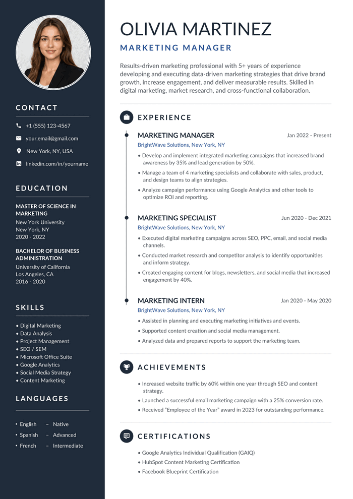
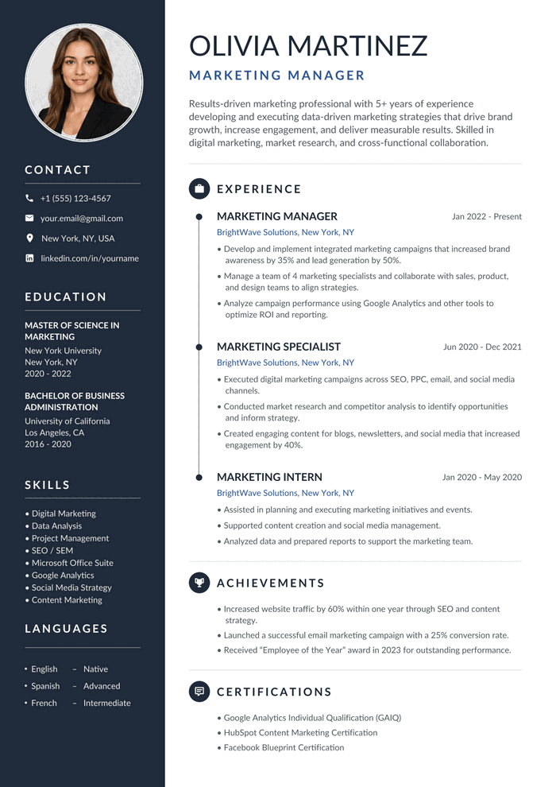
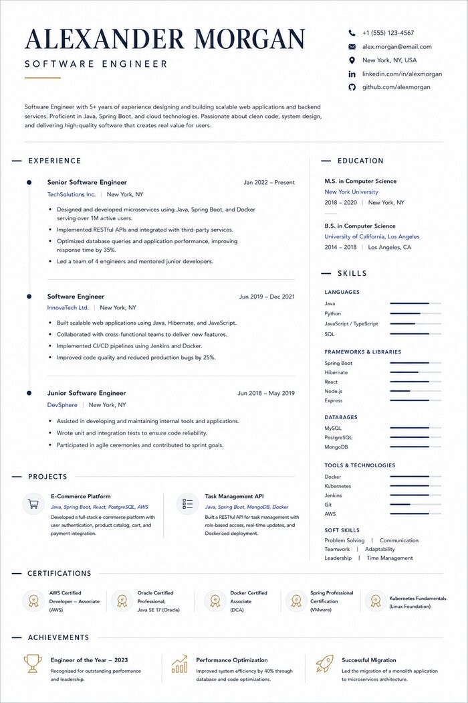
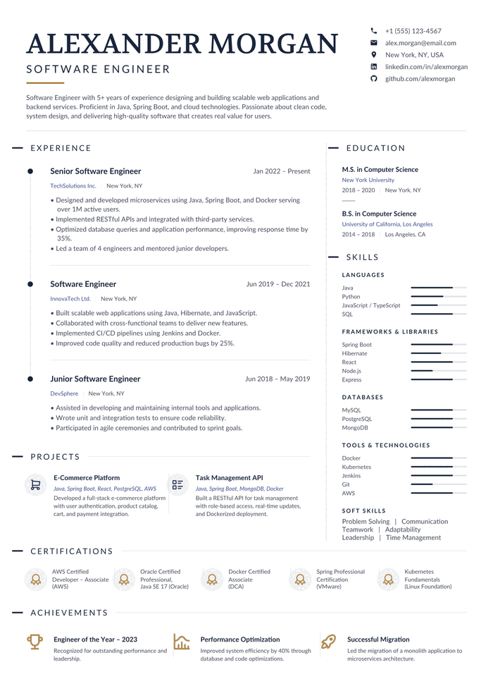
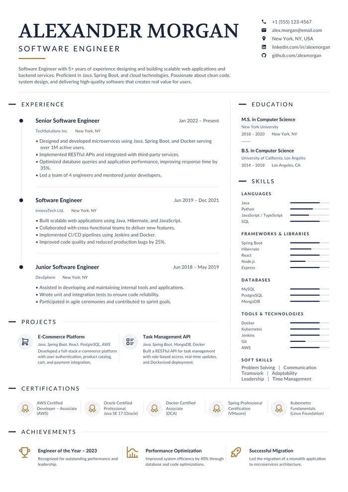

# GraphCompose AI Flow

[](https://github.com/DemchaAV/graphcompose-ai-flow/actions/workflows/ci.yml)

Install a GraphCompose harness into your coding agent. Drop in a
document reference. Ask Claude Code, Codex or Gemini CLI to recreate it.
The agent generates, renders, compares and iterates until the template is
ready for your approval.

```text
Create a GraphCompose CV template from resume.png
```

The output is not a drawing that happens to match one screenshot. It is
a maintainable Java template built from semantic GraphCompose primitives
— sections, rows, weights, anchors — with the content in a JSON data
file, the assets resolved and recorded, and every revision kept.

---

## Install

### Claude Code

```text
/plugin marketplace add DemchaAV/graphcompose-ai-flow
/plugin install graphcompose-flow@graphcompose
```

Then, once, **inside the installed plugin** — Claude Code puts it under
`~/.claude/plugins/cache/graphcompose/graphcompose-flow/<version>/`:

```bash
cd ~/.claude/plugins/cache/graphcompose/graphcompose-flow/<version>
npm run setup
```

Two of the tools are TypeScript compiled into `dist/`, which is not
committed, so a fresh install has no build output; until setup has run,
those two exit with code 69 and say so. Every `/plugin update` lands a
new `<version>` directory, so run it again after updating — or let the
first `preflight` of a run do it, which it will. Full instructions and
troubleshooting: [`docs/plugin-installation.md`](docs/plugin-installation.md).

### Codex

```bash
git clone https://github.com/DemchaAV/graphcompose-ai-flow
cd graphcompose-ai-flow
npm run setup
node adapters/codex/install.mjs
```

That copies the runtime to `~/.codex/graphcompose-flow/<version>/` and
installs four skills pointing into it, so **the clone is not needed
afterwards** — move it, rename it or delete it and the skills keep
working. See [`adapters/codex/README.md`](adapters/codex/README.md).

### Gemini CLI

```bash
git clone https://github.com/DemchaAV/graphcompose-ai-flow
cd graphcompose-ai-flow
npm run setup
node adapters/gemini/install.mjs
```

Gemini has extensions rather than plugins, so that writes one to
`~/.gemini/extensions/graphcompose-flow/` — four slash commands, the
workflow skill, the telemetry hooks and the runtime inside it — and the
clone is not needed afterwards either. Restart Gemini CLI, then
`gemini extensions list`. See
[`adapters/gemini/README.md`](adapters/gemini/README.md).

You need Node 20+, Java 21+, Maven and ImageMagick, plus a Java project
that pins GraphCompose — the version in *your* build file decides which
skill pack the agent authors against.

### Sixty seconds, end to end

Open your Java project — the one whose `pom.xml` or `build.gradle` pins
`io.github.demchaav:graph-compose` — in Claude Code, and:

```text
1.  node scripts/preflight.mjs --project-dir .        # version, pack, tools; builds what is unbuilt
2.  node scripts/init-workspace.mjs --project-dir . --project my-invoice
3.  drop the reference in the chat and say: "Create a GraphCompose invoice template from this"
```

The workspace step matters more than it looks: without it the work lands
inside the plugin install, which is replaced on the next update. From
there the skill runs the loop — analyse, author, render, compare, fix one
cause, repeat — and stops at `READY_FOR_APPROVAL` with the paths to
`output.pdf` and `output.png`. Say "approve" when it is right, and the
bundle lands under `graphcompose-flow/templates/`.

### Keep the document open while it works

Every render rewrites `current.pdf` next to the project's
`template-project.json`, so one open window follows the whole run — you
watch the layout arrive instead of hunting for the newest file under
`revisions/`. `current-debug.pdf` beside it is the same page with layout
guides drawn on.

That only works in a viewer which reloads a file when it changes **and
does not hold it open**. A viewer that keeps a lock on the PDF makes the
next render fail, which reads as a harness bug and is not one. On Windows
the one to use is [SumatraPDF](https://www.sumatrapdfreader.org/) — free,
open source, reloads on change, and lets go of the file. On macOS and
Linux, Preview and Evince both reload in place.

Open it once, at the start, and leave it there.

## Use

Open your Java project in the agent, give it the reference, and say what
you want. The skills fire from the words, so no command is needed:

| You say | What happens |
|---|---|
| "An invoice like the one we did before" | the catalog of published templates is checked **first** — a match is a file copy into your project, not the loop |
| "Create this in GraphCompose" (+ a screenshot) | analyse → architecture → assets → code → compile → render → diff → fix the largest mismatch → repeat |
| "Make the sidebar wider" | a new revision under the narrowest scope that fits, gated against the right baseline |
| "What's still different?" | a measured verdict and a ranked mismatch list, without changing anything |
| "approve" | DRAFT → APPROVED, the previous approved superseded, the bundle published |

Reuse is checked before reconstruction because the two cost different
orders of magnitude. `node scripts/templates.mjs` lists what has already
been published and `inspect <id>` says how to use it;
`node scripts/use-template.mjs <id> --target <java-project>` copies the
sources, assets and data in, or `--new-project <dir>` stands up a
runnable project from scratch. A published bundle carries no dependency
on this harness — it is Java, a JSON data file and a pom.

See [`docs/demo.md`](docs/demo.md) for a real transcript of the
deterministic half — version resolution, workspace creation, the chain,
the loop gate.

## What it produces

Two runs against the current harness. The middle column is what **one
request** produced — the reference, the sentence "create this", and no
further input. The right column is after the corrections.

That split is the thing worth judging. A first render is never right; the
question is how close one request gets, and what it costs to close the
rest.

### The whole loop, as it actually ran

Three runs on 2.2.0, recorded revision by revision. The left panel is the
reference; the right is what the harness rendered; the rail underneath is
every revision it took to get there. Nothing in either frame is
regenerated imagery — each step is the render that revision actually
produced.



**Invoice — 12 revisions, 113 minutes.** The first two did not compile,
which is the point of recording them: `revision-001` and `revision-002`
are FAILED and still on disk, with what broke and what was tried. The
last two were plain sentences with no instructions attached — *"пропали
разделители почему то"* (the dividers disappeared), then a note that the
SVG logo aligned left where the PNG did not. Approved at `revision-012`.



**CV — 10 revisions, 120 minutes**, from a screenshot and the sentence
"Create this screenshot as a GraphCompose template." The corrections in
the second half are the ones worth reading: initials that must derive
from the name rather than be hardcoded, a LinkedIn href that has to apply
to the icon as well as the text, a timeline rail that should not run
above its first marker. Approved at `revision-010`.



**Charcoal and gold CV — 9 revisions, and the ninth was one sentence.**
The loop declared itself ready at `revision-008`, after seven passes that
each named one thing and fixed it: calibrate the type scale against the
first render, calibrate the vertical rhythm against the measured line
boxes, drop the main column's uniform 9px offset, seat the skill bullets
in their own column. Then one sentence closed it — *"Кольцо таймлайна
должно закрывать рельс, а не пропускать его сквозь себя"* (the timeline
ring should close over the rail, not let it pass through). Approved at
`revision-009`.

No duration is quoted for that one. The session stayed open across a
long gap between `revision-003` and `revision-004`, so the telemetry
measures the window rather than the work, and a number that measures
the wrong thing is worse than no number.

All three were published as standalone bundles — template, typed spec,
data JSON, assets, previews — which is what the harness exists to
produce. The document is Java you can read and change; the content is a
JSON file next to it.

### Two-column CV with a photo, navy sidebar and a timeline rail

| Reference | One request | After 2 corrections |
|---|---|---|
|  |  |  |

Five revisions on its own, then it stopped and asked. The corrections
were about the timeline: the rail overran its markers, and a job title
drifted off centre. Three more revisions closed both. **8 revisions,
77 minutes end to end.**

The interesting part is what the loop did unprompted. Twice it could not
tell a layout fault from a painting fault, so it wrote a probe — a
throwaway document that renders one arrangement and measures the pixels —
and settled it. That is how it found that a shape container paints its
bottom margin *above* its box, and that an over-tall child is clamped to
the top rather than centred. Both are now
[recorded observations](observations/README.md) with probes that
re-confirm them, so the next run does not pay for them again.

### Single-column CV with a serif headline, skill bars and icon rows

| Reference | One request | After 3 corrections |
|---|---|---|
|  |  |  |

Eight revisions on its own — the reference is denser: a display serif
against a sans body, proportional skill bars, five icon-badged
certification cards, three achievement rows. Then three corrections, each
a plain sentence about what looked wrong, none of them explaining how to
fix it:

> вот только sertification и achivment разделитель вертикальный

The measured cost of that run, from the harness's own telemetry:

```text
create from the reference   68 min · 280.4k output · 61.0M cache read · 211 requests
first correction             7 min ·  25.2k output · 16.0M cache read ·  32 requests
second correction           10 min ·  36.4k output · 21.8M cache read ·  39 requests
approve and publish          2 min ·   8.1k output ·  6.5M cache read ·  11 requests
```

A correction costs roughly a tenth of the original run. That ratio is the
one to watch, and it is why the harness measures itself rather than
guessing — see [telemetry](scripts/telemetry/README.md) and
[the benchmark protocol](docs/benchmarks.md).

### What this does not claim

Neither run was pixel-perfect from one request, and the pixel-similarity
figure stayed unimpressive throughout both: the references are rasterised
in typefaces no bundled family reproduces, so glyph edges dominate the
comparison. What the runs show is that one request gets close enough to
correct in sentences, and that correcting it is cheap. Judge the images.

## How it works

The host agent supplies the model, the reasoning and the shell. This
project supplies the workflow, the GraphCompose knowledge and the gates.
Anything a script can decide is decided by a script:

```text
   your words              the loop                        the gate
   ──────────              ────────                        ────────
   reference    →   analyse · architect · code   →   render · diff · evaluate
                              ↑                              │
                              └────── fix one mismatch ──────┘
                                                             │
                                              READY_FOR_APPROVAL / BLOCKED
```

Five things make that more than a prompt:

- **The version decides the API.** `scripts/resolve-version.mjs` reads
  your `pom.xml` or `build.gradle`, maps the line to a skill pack, and
  stops if there is no pack — rather than authoring against an API your
  version does not have.
- **The gate is arithmetic.** A refactor must produce `AE == 0` against
  its parent. A data edit may differ only in the regions it touched. The
  metric is quoted, never paraphrased.
- **The loop is bounded.** `scripts/iterate-status.mjs` counts the
  iterations, the consecutive build failures and the repeats of the same
  mismatch, and answers 0 ready / 2 revise / 3 blocked. An agent going
  round in circles is the last thing qualified to notice it.
- **Nothing is overwritten.** Every change opens a revision; approving
  supersedes rather than replaces; a single component can be restored
  from any earlier one.
- **The geometry is measured, not guessed at.** The renderer writes
  GraphCompose's own post-layout snapshot beside the PDF, so "this block
  is too far right" is arithmetic rather than an argument about a
  screenshot. `node scripts/layout.mjs explain <node> x` answers it with
  the additive chain — `canvas.margin.left 0 + Sidebar.padding.left 17 +
  Heading.padding.left 9 = 26` — naming the node that *owns* the offset
  rather than the one that shows it. `diff` says whether a patch moved
  only what it meant to, `doctor` says whether the geometry sits on the
  node that owns it, and each of them will answer "I cannot derive this"
  rather than produce a number it cannot support.

[`docs/architecture.md`](docs/architecture.md) has the full picture,
including what this project deliberately does **not** build: no LLM API
integration, no MCP server, no standalone runtime.

## What is proven, and what is not

- **Claude Code** is the host the loop was tuned on: sixteen templates —
  invoices, proposals, CVs, a poster — carried to an approved published
  bundle in one workspace, and every number above is from that corpus.
- **Codex** fires the skill from a plain sentence, and the install is
  self-contained with the clone deleted. What is **not** recorded there
  is a run carried through to an approved published bundle.
- **Gemini CLI** is packaged and validated structurally; no run has been
  recorded on it.
- The GraphCompose **2.2 pack** ships with five fixtures rendering
  identically to their baselines; the conceptual skills stay
  `needs-validation` on coverage — five fixtures are a subset of what
  fourteen skills describe.
- The pixel figure never reaches zero against a rasterised reference and
  never will; the perceptual figure beside it is provisional until it has
  been measured against a person's judgement. Both are quoted, neither is
  a gate — [`docs/how-similarity-is-measured.md`](docs/how-similarity-is-measured.md)
  says exactly what each number is.
- Scope limits: [`docs/limitations.md`](docs/limitations.md). The measured
  baseline and what would move it: [`docs/benchmarks.md`](docs/benchmarks.md).

## For agents

[`AGENTS.md`](AGENTS.md) dispatches: which skill owns the task, the
seven invariants, the commands, and where each contract is declared.
Start there, not here.

## Working on the harness itself

Clone it, run `npm run setup`, and read
[`docs/quickstart.md`](docs/quickstart.md) — that is the contributor
path, where the workspace is this repository's own `examples/` rather
than a user's project. `npm run verify` runs every gate CI runs.

## Repository

| Path | What |
|---|---|
| [`skills/workflows/`](skills/workflows/README.md) | the four workflow skills and their shared references |
| [`skills/versions/`](skills/) | GraphCompose knowledge, one pack per library line |
| [`config/pipeline.json`](config/pipeline.json) | scope → stages, gates, loop bounds, failure categories |
| [`schemas/`](schemas/) | every on-disk contract |
| [`tools/`](tools/) | revision manager, renderer, visual diff, asset resolver |
| [`scripts/`](scripts/) | version resolver, workspace init, render, pipeline, loop gate, publish, verify |
| [`examples/cv-reference/`](examples/cv-reference/) | a worked chain — revisions 001 → 009 |

## License

[MIT](LICENSE).
